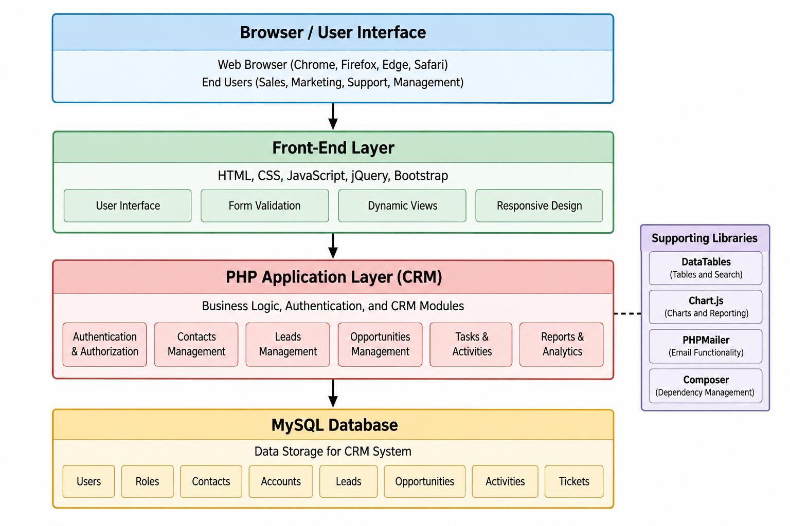

# CRM Research

# Part 1 -- AI-Based CRM Discovery

## 1. What is CRM?

**Definition/Purpose.** Customer Relationship Management (CRM) describes
practices, processes, and software used to manage relationships and
interactions with customers and prospects. CRM centralizes customer data
so teams can work from shared records instead of disconnected
spreadsheets, emails, and notes.

**History/Evolution.** CRM grew from contact-management and
sales-force-automation systems. Web and cloud computing expanded it into
opportunity management, marketing, customer service, workflows, mobile
access, integrations, analytics, and AI. Modern CRM is therefore a
customer-management platform rather than only a digital address book.

**Reflection.** ChatGPT produced the initial explanation. It was
complete enough for an introduction, but I verified modern capabilities
using official documentation. General concepts were trustworthy;
pricing, market claims, and version-specific facts required validation.

## 2. Why Organizations Use CRM

-   **Sales:** capture leads, manage opportunities, track
    communications, pipeline, and follow-ups.
-   **Customer management:** maintain shared contact, account,
    relationship, and activity histories.
-   **Marketing:** segment audiences, organize campaigns, and connect
    responses to leads.
-   **Support:** record cases/tickets, ownership, status, and issue
    history.
-   **Analytics:** report pipeline, conversions, activities, service,
    and performance.

**Reflection.** AI organized benefits well. I validated them against
real CRM documentation. Exact capabilities vary by product and
subscription.

## 3. Business Problems CRM Solves

  --------------------------------------------------------------------------
  Industry                Problem                    CRM Contribution
  ----------------------- -------------------------- -----------------------
  Retail                  Interactions scattered     Central customer
                          across channels            records, campaigns and
                                                     follow-ups

  Healthcare              Relationship workflows     Organizes appropriate
                          require coordination       relationship workflows;
                                                     privacy/compliance must
                                                     be evaluated separately

  Education               Prospective-student        Tracks inquiries,
                          outreach is hard to track  communications, events
                                                     and follow-ups

  Manufacturing           Long sales cycles involve  Connects accounts,
                          many accounts and contacts contacts, opportunities
                                                     and activities

  Nonprofits              Donor/volunteer/outreach   Centralizes
                          data is separated          relationships,
                                                     campaigns, tasks and
                                                     reports
  --------------------------------------------------------------------------

CRM does not automatically fix poor processes. Data quality, adoption,
governance, security, and workflow design still matter.

**Reflection.** AI generated useful examples, but they required critical
review. A general CRM, for example, should never automatically be
assumed suitable for protected healthcare data.

## 4. Major CRM Modules

Contacts store people; Accounts represent organizations; Leads represent
early prospects; Opportunities track potential sales; Activities/Tasks
record calls, meetings and follow-ups; Campaigns organize marketing;
Cases/Tickets track support; Reports summarize data; and Dashboards
visually present metrics.

**Reflection.** I validated this module set against SuiteCRM's official
user documentation.

# Part 2 -- CRM Product Comparison

## Commercial CRM Products

  ------------------------------------------------------------------------------------------------------
  Product        Target Customer       Strengths           Weaknesses/Considerations   Pricing Model
  -------------- --------------------- ------------------- --------------------------- -----------------
  Salesforce     SMB to enterprise     Deep ecosystem,     Cost/complexity can grow    Per-user
  Sales Cloud                          customization,                                  subscription;
                                       automation,                                     official U.S.
                                       analytics, AI                                   page showed
                                                                                       Starter Suite at
                                                                                       \$25/user/month
                                                                                       when checked

  HubSpot CRM    Startups, SMBs,       Easy entry, free    Advanced capabilities       Free tools plus
                 growing teams         tools, contacts,    require paid tiers          paid tiers; free
                                       deal pipelines,                                 tools listed for
                                       reporting                                       up to 2 users
                                                                                       when checked

  Zoho CRM       Small/midsize, with   Broad automation,   Configuration/product       Tiered per-user
                 enterprise options    customization,      choices require learning    subscription;
                                       analytics, Zoho                                 varies by edition
                                       ecosystem                                       and billing term

  Microsoft      Midsize/enterprise,   Microsoft 365       Licensing/implementation    Professional
  Dynamics 365   especially Microsoft  interoperability,   can be complex              \$65, Enterprise
  Sales          environments          reporting,                                      \$105, Premium
                                       automation,                                     \$150 per
                                       customization, AI                               user/month paid
                                                                                       yearly when
                                                                                       checked
  ------------------------------------------------------------------------------------------------------

### Analysis

**Most popular:** Salesforce appears to have the strongest overall
market visibility/ecosystem among these products. I would not use an
AI-generated market-share percentage without a current independent
market report.

**Small business:** I would start by evaluating HubSpot because the free
foundational tools lower the barrier and include core CRM functions.
Long-term paid-feature costs should still be compared.

**Large enterprise:** I would evaluate Salesforce and Microsoft Dynamics
365. Salesforce is strong for customization/ecosystem depth; Dynamics
365 is especially attractive where Microsoft technologies are already
central.

## Open-Source CRM Products

  ------------------------------------------------------------------------------------------------------------
  Product        Features         Technology/Deployment       Community                   Installation
  -------------- ---------------- --------------------------- --------------------------- --------------------
  SuiteCRM       Leads, accounts, PHP web app; Apache with    Mature project, official    Moderate
                 contacts,        MySQL/MariaDB supported in  docs/community              
                 opportunities,   current docs                                            
                 campaigns,                                                               
                 cases, reports,                                                          
                 dashboards                                                               

  EspoCRM        Accounts,        PHP;                        Active                      Moderate
                 contacts, leads, MySQL/MariaDB/PostgreSQL;   docs/community/extensions   
                 opportunities,   Docker documented                                       
                 configurable                                                             
                 entities                                                                 

  Odoo Community CRM within a     Open-source Community       Large ecosystem/community   Moderate--advanced
                 larger modular   edition                     apps                        
                 business suite                                                           
  ------------------------------------------------------------------------------------------------------------

**Most mature:** SuiteCRM and Odoo are mature in different ways.
SuiteCRM is a direct traditional CRM; Odoo combines CRM with a wider
business suite. I selected **SuiteCRM** for this CRM-focused assignment.

**Recommendations:** EspoCRM can suit a small technical team wanting a
focused CRM. SuiteCRM is attractive when a broader traditional feature
set and open-source control matter. A large organization considering
open source must budget for hosting, security, customization, backups,
upgrades, and support.

# Part 3 -- Open Source CRM Exploration

## Selected Product: SuiteCRM

SuiteCRM was selected because official documentation covers
authentication, dashboards, leads, accounts, contacts, opportunities,
activities, campaigns, cases, and reports.

## Installation Experience

SuiteCRM 8 documentation uses a LAMP-style setup as a base example:
Linux, Apache, MySQL/MariaDB, and PHP. Required PHP modules,
permissions, compatible versions, and URL rewriting must be configured.

**Ease:** Moderate. Documentation is helpful, but self-hosting requires
basic server, PHP, and database knowledge.

**Challenges:** version compatibility, PHP extensions, Apache
configuration, URL rewriting, file permissions, database credentials,
and environment-specific errors.

**How AI helped:** AI translated documentation into a checklist,
explained server terms, and suggested troubleshooting areas. Version
requirements were verified using SuiteCRM's official compatibility
matrix.

## Product Evaluation

**Impressive:** broad sales modules, cases, campaigns, activities,
reports, dashboards, and centralized customer information.

**Potential limitations:** self-hosting creates maintenance
responsibility; administration may require training;
integrations/customizations need planning.

**Would I use it?** Yes, I would consider SuiteCRM for an organization
that values open-source control and has technical support. For a very
small organization without IT support, a hosted CRM may be easier.

## Required Screenshots

Replace the placeholders in `screenshots/` with personally captured
SuiteCRM images: login, dashboard, contacts, leads, and reports.

# Part 4 -- CRM Architecture

## Functional Modules

Authentication/logout; user/role authorization; Contacts; Accounts;
Leads; Opportunities; Tasks/Activities; search/filtering;
dashboard/reports; audit/error logging. Later versions could add
campaigns, tickets, email automation, imports/exports, workflows, APIs,
and advanced analytics.

## Database Design

  Table              Purpose
  ------------------ --------------------------------
  users              Accounts and password hashes
  roles              Role definitions
  user_roles         User-role assignments
  contacts           Individual contacts
  accounts           Companies/organizations
  leads              Prospects
  opportunities      Sales opportunities
  activities         Calls, meetings, notes, tasks
  tickets            Support requests
  campaigns          Marketing campaigns
  campaign_members   Campaign recipients
  audit_log          Important security/data events

Use primary/foreign keys and indexes for common searches/joins.

## Useful Libraries

-   **Bootstrap:** responsive layout and reusable UI components.
-   **jQuery:** DOM, event, and AJAX convenience for the required stack.
-   **DataTables:** searching, ordering, and paging for HTML tables.
-   **Chart.js:** dashboard/report charts.
-   **PHPMailer:** SMTP-based application email.
-   **Composer:** PHP dependency management.

## Security

Use HTTPS, secure sessions, rate limiting, and preferably MFA. Enforce
role-based authorization on the server. Store passwords with PHP
password-hashing APIs, never plaintext. Prevent SQL injection with
PDO/MySQLi prepared statements. Encode output to reduce XSS risk,
validate input, and consider Content Security Policy. Protect
state-changing requests with CSRF tokens. Limit collected data, restrict
access, protect backups, log important actions, and define
retention/privacy practices.

## MVP Proposal

Version 1 should include login/logout and roles, Contacts, Leads,
Opportunities, Tasks/Activities, search/filtering, a simple dashboard,
basic reports, input validation, prepared database queries, output
encoding, CSRF protection, and audit/error logging. The core workflow is
**lead → contact/relationship → opportunity → follow-up → reporting**.

## Architecture Diagram

The browser runs the HTML/CSS/JavaScript/jQuery/Bootstrap interface.
Requests go to PHP for authentication, authorization, validation, and
CRM business logic. PHP accesses MySQL using parameterized operations.
Supporting libraries provide tables, charts, email, and dependency
management.
